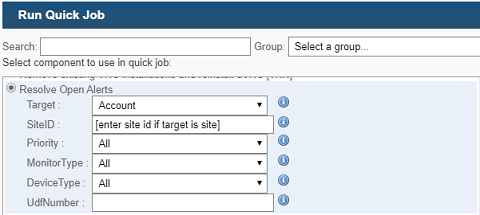
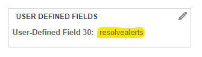

# Resolve Open Alerts

A Datto RMM Component to resolve Open Alerts via the RMM API.

> This Component compliments existing Alert Resolution options in RMM, offering more flexibility and control over Alert Resolution, especially for 100s and 1000s of Open Alerts.

    
   

> 

## Prerequisites

- Valid RMM API token, saved on target device as `$Env:RMMAPIKey`, see [RMM API docs](https://help.aem.autotask.net/en/Content/2SETUP/APIv2.htm)
- Preconfigured [Environment Variables](#environment-variables)

## Deployment

- [Download `resolve-open-alerts-v2`](https://github.com/piouson/Resolve-Open-Alerts/releases)
- [Import Component in RMM](https://help.aem.autotask.net/en/Content/4WEBPORTAL/Components/ManageComponents.htm#Import_a_component), select `resolve-open-alerts-v2.cpt` and save
- Set `$Env:RMMAPIKey` **System** variable on target device, see [environment variables](#environment-variables)
- Use a [Quick Job](https://help.aem.autotask.net/en/Content/4WEBPORTAL/Jobs/Quick_Jobs.htm) or [Job Scheduler](https://help.aem.autotask.net/en/Content/4WEBPORTAL/Jobs/Job_Scheduler.htm) and select the target device

## Environment Variables

If running in production (e.g. from RMM), you only need to configure `$Env:RMMAPIKey` at [**System** level](https://docs.microsoft.com/en-us/powershell/module/microsoft.powershell.core/about/about_environment_variables?view=powershell-7#saving-changes-to-environment-variables) to hold the RMM API token before [deployment](#deployment).

> This is not suitable as [RMM Site Variable](https://help.aem.autotask.net/en/Content/4WEBPORTAL/Sites/SiteSettings.htm#Variables) due to its character length limitation.

```powershell
# run as administrator
[Environment]::SetEnvironmentVariable('RMMAPIKey', 'enter-api-token-here', 'Machine')
```

> Requires process refresh to verify changes or just open a new Powershell terminal

```powershell
[Environment]::GetEnvironmentVariable('RMMAPIKey', 'Machine')
```

Other variables required at deployment time, must be set manually in [`Invoke-MockComponent`](https://github.com/piouson/Resolve-Open-Alerts/blob/71b99a72c550e37e3bc72e8a6fd06ce743bd4083/ResolveAllOpenAlerts.ps1#L292) for local development and mock testing.

- `$Env:CS_WS_ADDRESS` - preconfigured in RMM {`merlot-centrastage.net` | `concord-centrastage.net` | etc}
- `$Env:Target` {`site` | `account`}, default is site of device running component
- `$Env:SiteID`, set here if `$Env:Target` = `"site"`
- `$Env:Priority` {`All` | `Information` | `Low` | `Moderate` | `High` | `Critical`}
- `$Env:MonitorType`, use Monitor Class names
- `$Env:DeviceType` {`Desktop` | `Laptop` | `Server` | `ESXI Host` | `Printer` | `Network Device`}
- `$Env:UdfNumber` {`1-30`}, UDF must be set to `"resolvealerts"` in RMM, see image below

> 

See [variables in Powershell](https://docs.microsoft.com/en-us/powershell/module/microsoft.powershell.core/about/about_environment_variables) and [variables in RMM](https://help.aem.autotask.net/en/Content/2SETUP/AccountSettings/AccountSettings.htm#Variables).

## Running Directly in Powershell

The quickest way to try out this component is by running in Powershell.

- [Clone or Download source code](https://github.com/piouson/Resolve-Open-Alerts)
- Unzip to a suitable path
- Open `ResolveOpenAlerts.ps1` in [Visual Studio Code](https://code.visualstudio.com/), [Powershell ISE](https://docs.microsoft.com/en-us/powershell/scripting/components/ise/introducing-the-windows-powershell-ise) or your favourite Powershell IDE.
- Define [environment variables](#environment-variables) in [`Invoke-MockComponent`](https://github.com/piouson/Resolve-Open-Alerts/blob/71b99a72c550e37e3bc72e8a6fd06ce743bd4083/ResolveAllOpenAlerts.ps1#L292) for testing or just above `Invoke-RMMComponent` for production/live
- For testing, switch to development mode, see [Running Tests](#running-tests)
- Run script

> The default RMM script timeout of 1 hour should resolve max 30,000 Alerts.

## Running Tests

> Requires [environment variables](#environment-variables).

Unit Tests have not been written for any functions yet, but [`Invoke-MockComponent`](https://github.com/piouson/Resolve-Open-Alerts/blob/71b99a72c550e37e3bc72e8a6fd06ce743bd4083/ResolveAllOpenAlerts.ps1#L292) can be used for local development, Integration Testing and/or Stress Testing. Just uncomment invocation at bottom of file, see snippet below.

```powershell
# production/live mode
#Invoke-MockComponent
Invoke-RMMComponent
```

```powershell
# development mode
Invoke-MockComponent
#Invoke-RMMComponent
```

> When using [`Invoke-MockComponent`](https://github.com/piouson/Resolve-Open-Alerts/blob/71b99a72c550e37e3bc72e8a6fd06ce743bd4083/ResolveAllOpenAlerts.ps1#L292), Alerts are **never resolved**. Alert Resolution is simulated by using already Resolved Alerts as mock data.

For actual Alert Resolution in local development, use [`Invoke-RMMComponent`](https://github.com/piouson/Resolve-Open-Alerts/blob/71b99a72c550e37e3bc72e8a6fd06ce743bd4083/ResolveAllOpenAlerts.ps1#L261) directly with [environment variables](#environment-variables).

## Contributing

Anyone can contribute.

- Open a [new issue](https://github.com/piouson/Resolve-Open-Alerts/issues) to request bug fixes, features or a simple question
- Create a [pull request](https://github.com/piouson/Resolve-Open-Alerts/pulls) to submit your own fixes, unit tests, features, or for typos and document updates
- Submit test cases

## License

[](https://github.com/piouson/Resolve-Open-Alerts/blob/master/LICENSE)
